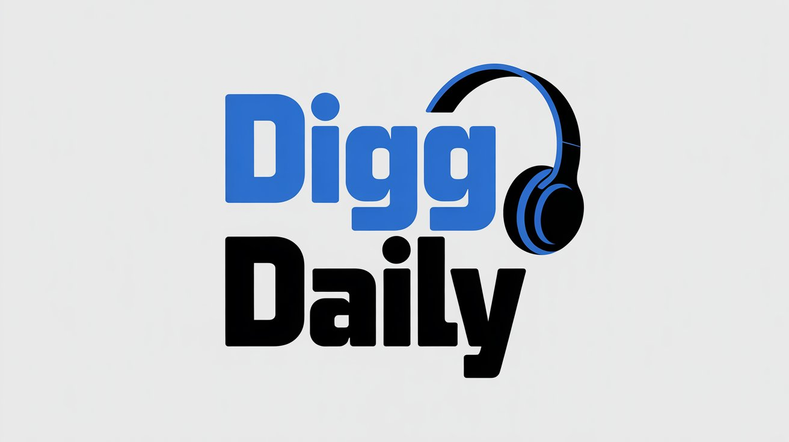

# Digg Daily RSS Feed & Chrome Extension



> 📻 Listen to Digg Daily in the podcast app of your choice — no browser required.

## What This Project Does

**This project does NOT create the AI audio content.** Digg Daily is an AI-generated news digest produced and hosted by [Digg.com](https://digg.com). We simply provide a **podcast-friendly RSS feed wrapper** so you can listen to it on the go in your favorite podcast player, rather than being tied to the Digg website.

This project provides two ways to access Digg Daily outside the website:

1. **Podcast RSS Feed** - Subscribe in any podcast app (Apple Podcasts, Pocket Casts, Overcast, etc.)
2. **Chrome Extension** - Quick one-click access to today's episode from your browser

> **⚠️ Disclaimer:** This is an **unofficial, community-created** project. We are **not affiliated with Digg.com**. All audio content is created, owned, and hosted by Digg. This tool simply wraps their publicly available audio files into a standard podcast RSS format for easier consumption.
>
> The [/diggdaily community](https://digg.com/diggdaily) is curated by [@roland](https://digg.com/@roland). This RSS feed project is created by [@pixelnated](https://digg.com/@pixelnated).

## 🎧 Podcast Feed

### Subscribe Now

**🔗 [Subscribe Page](https://pixelnated.github.io/digg-daily-rss/)** | **[Direct Feed URL](https://pixelnated.github.io/digg-daily-rss/feed.xml)**

```
https://pixelnated.github.io/digg-daily-rss/feed.xml
```

### Supported Podcast Apps

- **[Apple Podcasts](https://www.apple.com/apple-podcasts/)**: Library → Add Show by URL
- **[Spotify](https://spotify.com/)**: Not supported (doesn't allow custom RSS)
- **[Pocket Casts](https://pocketcasts.com/)**: Search → Enter RSS URL
- **[Overcast](https://overcast.fm/)**: Add URL → Paste feed URL
- **[AntennaPod](https://antennapod.org/)**: + → Add podcast by URL
- **[Podcast Addict](https://podcastaddict.com/)**: + → Add by RSS URL
- **[Castro](https://castro.fm/)**: Settings → Subscribe by URL

### How It Works

The feed is automatically updated daily via GitHub Actions:

1. Fetches episodes from **Digg's official API** (same source used by the digg.com player)
2. Constructs direct audio URLs from the CloudFront CDN
3. Generates a podcast-compatible RSS feed
4. Publishes to GitHub Pages

## 🔧 Local Development

### Prerequisites

- Python 3.10+
- pip

### Installation

```bash
cd digg_daily_rss
pip install -r requirements.txt
```

### Generate Feed Locally

```bash
# Generate feed
python feed_generator.py

# Custom options
python feed_generator.py --limit 20 --output my-feed.xml
```

### Test API

```bash
python scraper.py
```

## 🌐 Deploy to GitHub Pages

1. **Fork/Clone this repository**

2. **Enable GitHub Pages**:
   - Go to Settings → Pages
   - Source: GitHub Actions

3. **Enable Actions**:
   - Go to Actions tab
   - Enable workflows

4. **Configure (optional)**:
   - Edit `.github/workflows/update-feed.yml` to change schedule
   - Default: Runs daily at 2 PM UTC (9 AM ET)

5. **Get your feed URL**:
   ```
   https://pixelnated.github.io/digg-daily-rss/feed.xml
   ```

## 🧩 Chrome Extension

A lightweight browser extension for quick access to Digg Daily.


### Features

- 🎵 Built-in audio player in popup
- 📻 Auto-fetches today's episode
- 🔄 30-minute cache for fast loading
- 🔗 Links to full episode on Digg
- ⬇️ Download MP3 option
- 🖼️ Highlights official episodes on digg.com

### Installation

#### Option 1: Download from Releases (Recommended)

1. Go to [Releases](https://github.com/pixelnated/digg-daily-rss/releases)
2. Download the latest `digg-daily-extension-x.x.x.zip`
3. Extract the ZIP to a folder
4. Open `chrome://extensions/` in Chrome
5. Enable **Developer mode** (top right)
6. Click **Load unpacked**
7. Select the extracted folder

#### Option 2: Clone and Load (Developer Mode)

1. Clone this repository
2. Open `chrome://extensions/`
3. Enable **Developer mode** (top right)
4. Click **Load unpacked**
5. Select the `chrome-extension` folder

### Creating Icons

The extension needs PNG icons. Create them using:

```bash
# With ImageMagick
cd chrome-extension/icons
convert -size 128x128 xc:'#4a9eff' -gravity center \
  -pointsize 64 -fill white -annotate 0 'd▶' icon128.png
convert icon128.png -resize 48x48 icon48.png
convert icon128.png -resize 16x16 icon16.png
```

Or use the SVG in `icons/README.md` with an online converter.

## � Creating a Release

### Using GitHub Actions (Recommended)

1. Go to **Actions** → **Release Chrome Extension**
2. Click **Run workflow**
3. Enter the version (e.g., `1.0.0-beta.1`)
4. Choose whether it's a pre-release
5. Click **Run workflow**

This will create a GitHub Release with the packaged extension ZIP attached.

### Local Packaging (PowerShell)

```powershell
.\scripts\package-extension.ps1 -Version "1.0.0-beta.1"
```

The ZIP will be created in the `dist/` folder, ready for:
- Manual GitHub release upload
- Chrome Web Store submission

## 📁 Project Structure

```
digg_daily_rss/
├── scraper.py              # Scrapes digg.com/diggdaily for episodes
├── feed_generator.py       # Generates podcast RSS feed
├── requirements.txt        # Python dependencies
├── .github/
│   └── workflows/
│       ├── update-feed.yml     # Daily feed update workflow
│       └── release-extension.yml # Extension release workflow
├── chrome-extension/       # Browser extension
│   ├── manifest.json
│   ├── popup.html/css/js
│   ├── background.js
│   ├── content.js/css
│   └── icons/
├── scripts/                # Build scripts
│   └── package-extension.ps1
├── images/                 # Project images (logo, etc.)
├── output/                 # Generated feed (local)
└── cache/                  # Cached episode data (local)
```

## ❓ FAQ

### Why only "official" Digg Daily?

The `/diggdaily` community has two types of posts:
- **Official Digg Daily** - AI-generated, hosted on Google Drive
- **Homemade Digg Recap** - Human-read by @roland, usually on Spotify

This tool defaults to official-only because:
1. Consistent audio format (Google Drive MP3)
2. Same AI hosts each day
3. What most people mean by "Digg Daily"

Use `--all` flag to include both.

### Can I share this feed?

Yes! Once deployed to GitHub Pages, anyone can subscribe to your feed URL.

### Audio not playing in podcast app?

Some apps have issues with Google Drive redirect URLs. If your app doesn't work:
1. Try a different podcast app
2. Use the Chrome extension for direct playback
3. Download episodes manually

### How do I change the update schedule?

Edit `.github/workflows/update-feed.yml`:

```yaml
schedule:
  - cron: '0 14 * * *'  # 2 PM UTC daily
```

See [cron syntax](https://crontab.guru/) for help.

## 📜 License

MIT License - See [LICENSE](LICENSE)

## ⚠️ Disclaimer

This is an **unofficial, community-created** project and is **not affiliated with or endorsed by Digg.com**.

- **We do NOT create the AI-generated audio content** — that is produced entirely by Digg
- **We do NOT host the audio files** — they are served directly from Digg's CDN
- **We only provide an RSS feed wrapper** — making it easier to consume Digg Daily in podcast apps

All podcast content, including the AI-generated audio summaries, belongs to Digg.com. This tool simply aggregates publicly available audio files into a standard podcast RSS format so you can listen on the go without visiting the website.

If Digg requests removal of this project, we will comply.

---

Made with ☕ for Digg Daily fans who want it in their podcast feed.
